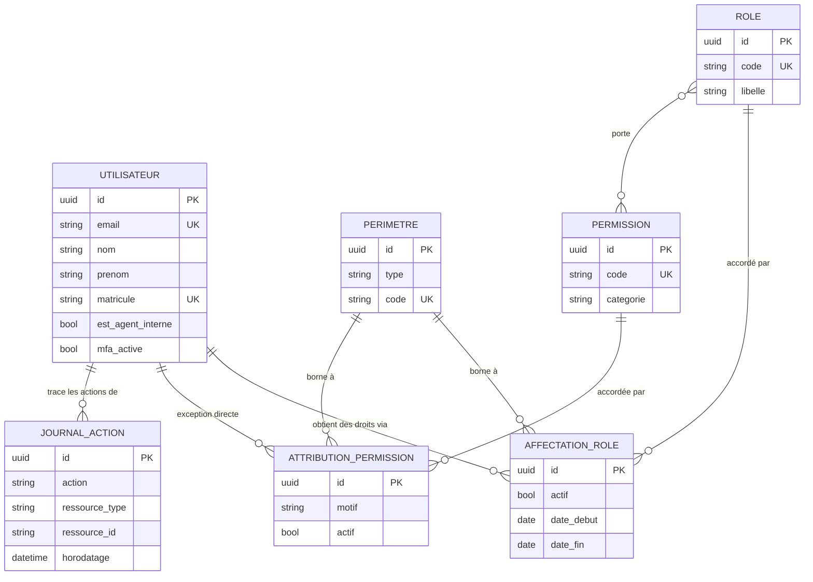

# Modèle de données — état Phase 0

Ce diagramme reflète **ce qui existe réellement** dans les migrations à ce stade
(`apps.comptes`, `apps.audit`). Le modèle cible complet (§5 du cahier des charges —
`demandes_visite`, `candidatures`, `courriers`, `documents`, `detenus`, etc.) sera
documenté ici au fur et à mesure que chaque bloc livre ses migrations réelles ; le
reproduire par anticipation sur des tables qui n'existent pas encore induirait en
erreur quiconque lit ce document pour comprendre l'état du dépôt.

## Dictionnaire de données (Phase 0)

| Table | Rôle | Contrainte notable |
|---|---|---|
| `utilisateurs` | Compte nominatif | `email` unique, PK UUID v7 |
| `permissions` | Droit élémentaire | `code` unique (format `module:action`) |
| `roles` | Profil métier (paquet de permissions) | `code` unique |
| `perimetres` | Portée organisationnelle (national/direction/établissement) | `code` unique |
| `affectations_role` | Rôle accordé à un utilisateur sur un périmètre | unique (utilisateur, rôle, périmètre) |
| `attributions_permission` | Permission accordée directement, hors rôle | unique (utilisateur, permission, périmètre) |
| `journal_actions` | Audit append-only | aucune contrainte de mise à jour (voir `apps.audit`) |

## À venir

Chaque bloc (B à G, voir `docs/architecture.md`) ajoutera ses entités réelles à ce
document au moment de sa livraison, pas avant.
