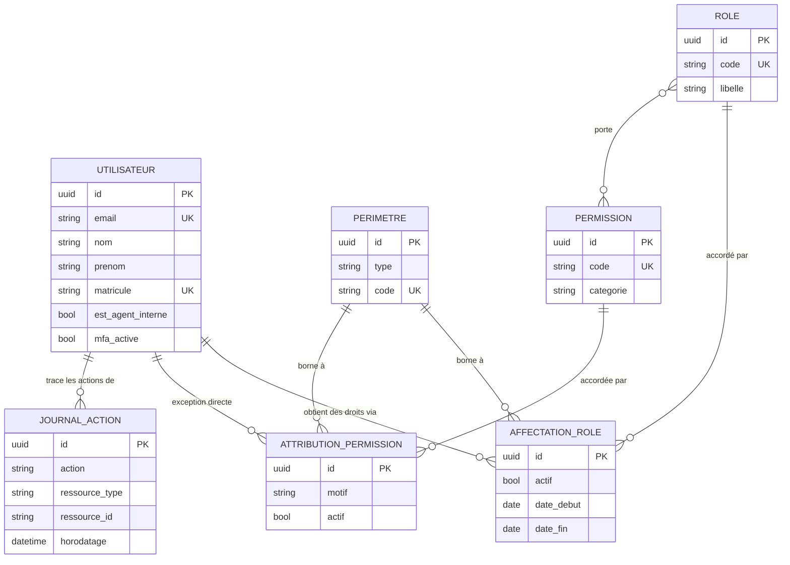
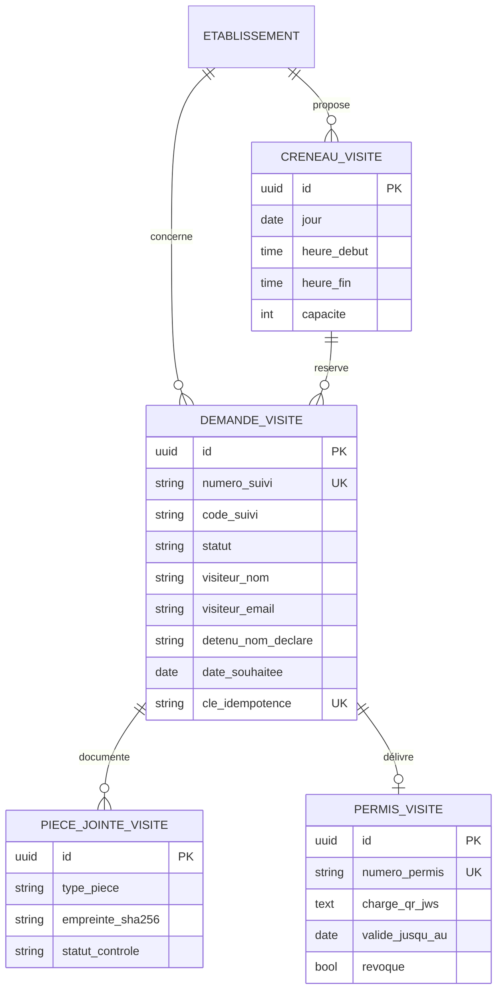
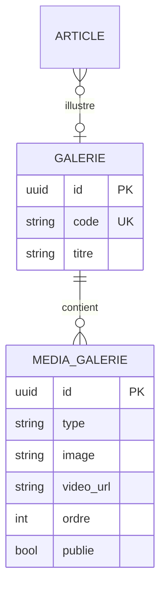
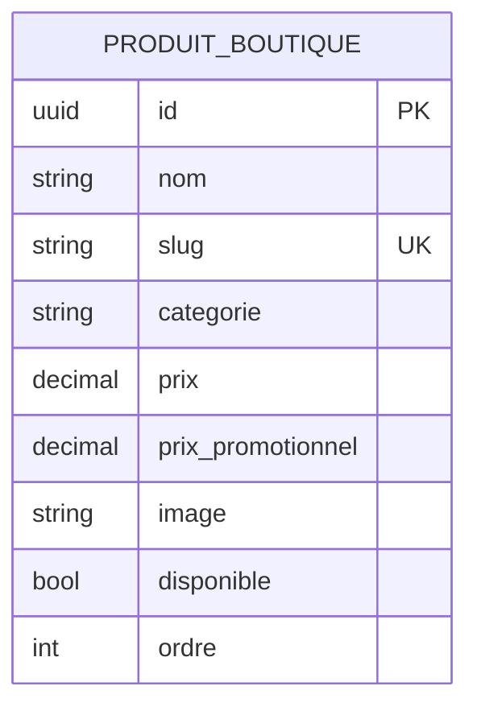

# Modèle de données — état Phase 0

Ce diagramme reflète **ce qui existe réellement** dans les migrations à ce stade
(`apps.comptes`, `apps.audit`). Le modèle cible complet (§5 du cahier des charges —
`demandes_visite`, `candidatures`, `courriers`, `documents`, `detenus`, etc.) sera
documenté ici au fur et à mesure que chaque bloc livre ses migrations réelles ; le
reproduire par anticipation sur des tables qui n'existent pas encore induirait en
erreur quiconque lit ce document pour comprendre l'état du dépôt.

## Dictionnaire de données (Phase 0)

| Table | Rôle | Contrainte notable |
|---|---|---|
| `utilisateurs` | Compte nominatif | `email` unique, PK UUID v7 |
| `permissions` | Droit élémentaire | `code` unique (format `module:action`) |
| `roles` | Profil métier (paquet de permissions) | `code` unique |
| `perimetres` | Portée organisationnelle (national/direction/établissement) | `code` unique |
| `affectations_role` | Rôle accordé à un utilisateur sur un périmètre | unique (utilisateur, rôle, périmètre) |
| `attributions_permission` | Permission accordée directement, hors rôle | unique (utilisateur, permission, périmètre) |
| `journal_actions` | Audit append-only | aucune contrainte de mise à jour (voir `apps.audit`) |

## Bloc D — Téléservice Visites (`apps.visites`)

| Table | Rôle | Contrainte notable |
|---|---|---|
| `demandes_visite` | Dépôt en ligne, machine à états | `numero_suivi`/`cle_idempotence` uniques |
| `creneaux_visite` | Plages horaires par établissement | capacité bornée |
| `pieces_jointes_visite` | Justificatifs téléversés | SHA-256 calculé à l'enregistrement |
| `permis_visite` | Permis signé (JWS), 1↔1 avec la demande | `numero_permis` unique |

## Extension Bloc B — Galeries (`apps.mediatheque`)

| Table | Rôle | Contrainte notable |
|---|---|---|
| `galeries` | Collection de médias, référencée par `code` | `code` unique |
| `medias_galerie` | Image (MinIO) ou vidéo (lien incorporé) | exactement un des deux selon `type` |

## Boutique (`apps.boutique`)

Vitrine des produits fabriqués par les personnes détenues — catalogue de
présentation uniquement, aucune entité panier/commande/paiement (décision produit).

| Table | Rôle | Contrainte notable |
|---|---|---|
| `produits_boutique` | Fiche produit, vitrine publique filtrable par `categorie` | `slug` unique ; ni panier ni paiement |

## À venir

Le bloc E (`apps.concours`, `apps.paiements` — voir `docs/architecture.md`) est
livré et fonctionnel mais son MCD reste à documenter ici. Les blocs F et G
restants ajouteront leurs entités réelles à ce document au moment de leur
livraison, pas avant.
